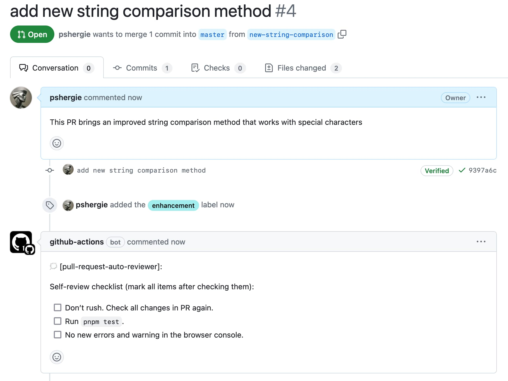

# Pull Request Auto Reviewer Private (GitHub Action)



_The script works only in private repos. For public ones you should use [prator](https://github.com/pshergie/prator)_.

Add review comments to your pull requests based on changes in 2 steps:

1. Create a file with rules for the action script. [(more info)](#add-rules-for-the-action-script):

```yml
- prependMsg: "🗯️ [pull-request-auto-reviewer](https://github.com/pshergie/prator-private):"
- checks:
    - paths: "**/*.js"
      message: |
        ### Please tick the following checkboxes:

        - [ ] the code is tested
        - [ ] files are compressed
        - [ ] files contain no errors
````

2. Create a workflow [(more info)](#add-the-action-to-your-config):

```yml
name: Auto-review comment
on:
  pull_request:
    branches:
      - main
      - master
permissions:
  pull-requests: write
  contents: read
jobs:
  prepare:
    name: Auto-review
    runs-on: ubuntu-latest
    steps:
      - name: Checkout code
        uses: actions/checkout@v4
        with:
          fetch-depth: 2
      - name: Analyze changes
        uses: pshergie/prator-private@v1
        with:
          token: ${{ secrets.GITHUB_TOKEN }}
          rules-path: path-to-your-rules-file
```

## Add rules for the action script

For this step you need to create a YAML file with the rules that are going to be utilized by the action script. There you need to specify 2 params:

- `prependMsg` is a message that is prepended to every message of GitHub actions bot. Leave empty if not needed.
- `checks` contains a list of `paths` and `message` keys. `paths` is dedicated to specify path(s) of changes that would trigger posting of a followed `message` as a pull request comment. In case of multiple `paths` they should be separated by a comma. `message` could be a simple string or markdown. All messages will be combined into a single comment.

## Add the action to your config

In this step create a workflow that uses the action script. `pull-requests: write` permission is needed for the GitHub actions bot to be able to post a comment in a PR. `contents: read` permission is needed to read the necessary info of your repo. `fetch-depth` is needed for a correct work of a diff fetch in the script. It's also important to provide 2 params that are being consumed by the action script:

- `token`: your GitHub token
- `rules-path`: a path to the file with rules that you have specified earlier (for instance `.github/auto-review-rules.yml`)
